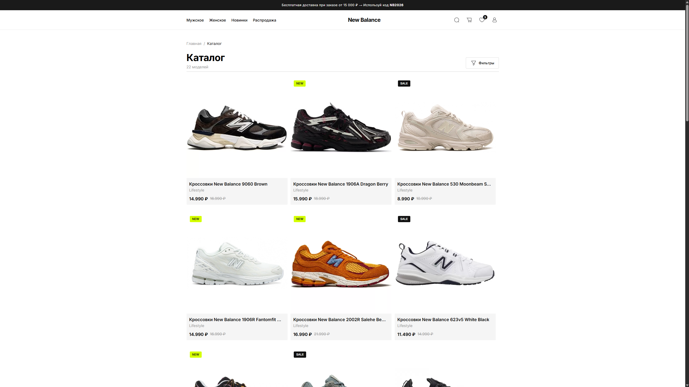
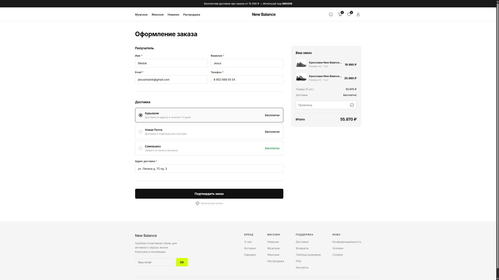
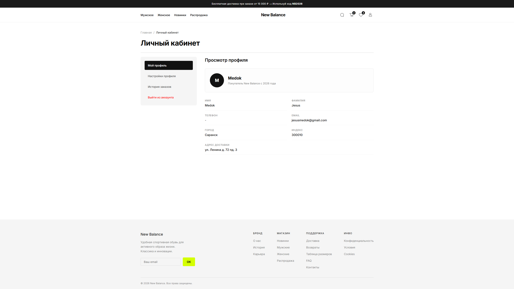
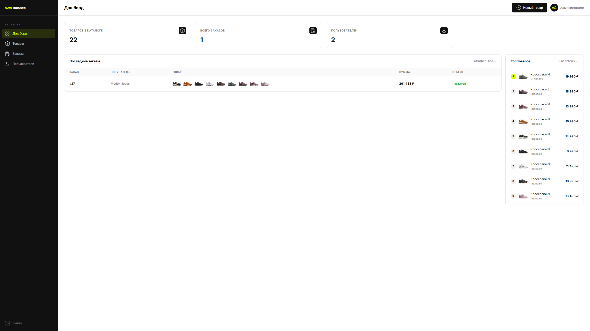

<div align="center">


<p>
  
  
  
  
  
</p>

<p>
  
  
  
</p>

</div>

---

##  О проекте

Пет-проект интернет-магазина в стиле **New Balance**: каталог кроссовок, фильтры, корзина, избранное, оформление заказа с реальной интеграцией оплаты (в тестовом режиме) и полноценная админ-панель для управления товарами и заказами.

Сделано на **Angular 21** (standalone + signals + SSR) с бэкендом на **Supabase**.

---

##  Демо

<!-- 
  Скриншоты лежат в папке assets-readme/ в корне репозитория.
  Просто закинь туда свои файлы с такими же именами (или поменяй имена ниже под свои).
-->

<div align="center">




<p><i>Каталог и фильтры &nbsp;•&nbsp; Корзина и оформление заказа</i></p>




<p><i>Личный кабинет &nbsp;•&nbsp; Админ-панель</i></p>

</div>

---

##  Стек технологий

| Категория | Технологии |
|---|---|
| Frontend | Angular 21, TypeScript, SCSS, Angular CDK |
| Backend | Supabase (Auth, Database, Storage, Edge Functions) |
| Оплата | Stripe (тестовый режим) |
| Рендеринг | Angular SSR |

---

##  Возможности

<table>
<tr><td width="28"></td><td>Регистрация и авторизация (Supabase Auth)</td></tr>
<tr><td></td><td>Каталог товаров с фильтрами: пол, размер, цена, рейтинг, метки (new/sale)</td></tr>
<tr><td></td><td>Поиск по товарам</td></tr>
<tr><td></td><td>Избранное</td></tr>
<tr><td></td><td>Корзина с изменением количества и подсчётом стоимости</td></tr>
<tr><td></td><td>Оформление заказа и оплата через Stripe</td></tr>
<tr><td></td><td>Промокоды на скидку</td></tr>
<tr><td></td><td>Личный кабинет: профиль, адрес доставки, смена пароля, история заказов</td></tr>
<tr><td></td><td>Админ-панель: дашборд со статистикой, товары, заказы, пользователи</td></tr>
</table>

---

##  Запуск проекта

```bash
# Клонировать репозиторий
git clone https://github.com/medok-ui/newbalance-store.git
cd newbalance-store

# Установить зависимости
npm install

# Запустить дев-сервер
ng serve
```

Приложение будет доступно на `http://localhost:4200/`.

> Для полноценной работы нужен настроенный проект **Supabase** (Auth, таблицы, Storage, Edge Functions) — см. `src/environments/environment.ts` и `supabase/config.toml`.

---

##  Тестовая оплата

Оплата в проекте **полностью тестовая** (Stripe test mode) — реальные деньги не списываются, бояться нечего 🙂

| Поле | Значение |
|---|---|
| Номер карты | `4242 4242 4242 4242` |
| Срок действия | любая дата в будущем (например `12/34`) |
| CVC | любые 3 цифры (например `123`) |
| Имя на карте / индекс | любые значения |

---

##  Промокоды

Промокоды хранятся в таблице `promo_codes` в Supabase и применяются на странице оформления заказа:

| Промокод     | Скидка |
| ------------ | ------ |
| `medok`      | 50%    |
| `baryl`      | 30%    |
| `whitemaks`  | 25%    |
| `friend20`   | 20%    |
| `sneaker15`  | 15%    |
| `nb2026`     | 10%    |

---

##  Если долго грузится

Supabase и Stripe иногда медленно отвечают в некоторых регионах — если страница долго грузится или зависает, попробуйте включить **VPN**.

---

##  Статус проекта

| | |
|---|---|
|  | Основной функционал магазина работает стабильно |
|  | Адаптив под мобильные устройства и планшеты пока не сделан — корректно отображается только на десктопе |
|  | Интерфейс только на русском языке |
|  | Возможны мелкие баги — если нашли что-то не так, пишите админу |

---

##  Контакты

По всем вопросам, багам и предложениям:

<div align="center">

[](https://t.me/MedokDev)

</div>

<div align="center">

</div>
